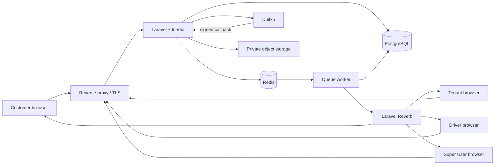
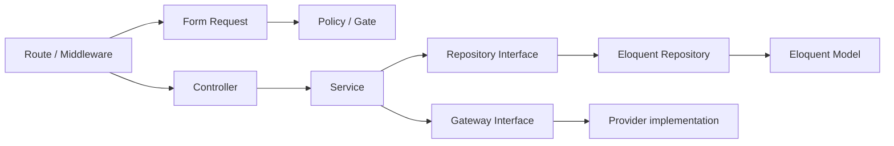
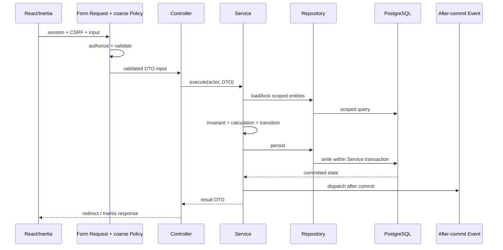

# Arsitektur

> Source of truth bisnis: [`01-product-scope.md`](01-product-scope.md). Dokumen ini menerjemahkan scope tersebut menjadi batas arsitektur dan dependency rule yang wajib dipatuhi.

## Pilihan utama

Gunakan **modular modern monolith**: satu aplikasi Laravel menangani HTTP, authentication, authorization, business rules, persistence, queue, callback payment, dan broadcasting. React merender UI melalui Inertia. MVP tidak memiliki microservice atau REST API internal terpisah.

Project pattern wajib adalah:

```text
Controller -> Service -> Repository Interface -> Eloquent Repository -> Model
                     \-> External Gateway (Duitku/object storage)
```

Pattern ini dipilih untuk membuat business logic dapat diuji terpisah, menjaga controller tetap tipis, dan mengisolasi detail persistence. Konsekuensinya adalah jumlah class bertambah dan boundary harus dijaga konsisten. Dilarang membuat abstraction generik yang tidak mewakili kebutuhan domain.

## Database development dan portability

PostgreSQL tetap menjadi transactional source of truth untuk staging/production. Selama foundation awal, local development dan test default memakai SQLite agar onboarding ringan. Migration, constraint dasar, Eloquent query, dan tipe data harus memakai subset yang bekerja pada keduanya; PostgreSQL job di CI menjadi compatibility gate sebelum merge.

Vendor-specific SQL, generated column, full-text, JSON operator, atau locking behavior tidak boleh diasumsikan kompatibel hanya karena lulus SQLite. Jika kebutuhan tersebut muncul, sediakan implementasi PostgreSQL yang eksplisit dan integration test PostgreSQL. Redis tetap target untuk queue/cache/session/realtime, tetapi local foundation memakai driver database/array sampai workload tersebut diimplementasikan.



## Layer contract

### Controller dan Form Request

Controller adalah HTTP adapter, bukan tempat business logic.

Controller hanya boleh:

- menerima dependency Service melalui constructor injection;
- menerima `FormRequest` yang melakukan validation serta coarse role authorization tanpa query Model;
- mengubah validated input menjadi DTO/command tanpa keputusan bisnis;
- memanggil tepat satu public Service method untuk satu use case;
- membentuk Inertia response, redirect, atau HTTP response dari hasil Service.

Controller dilarang:

- mengakses Eloquent Model, query builder, `DB`, atau Repository secara langsung;
- menghitung harga, komisi, jarak eligibility, payout, refund, atau status berikutnya;
- membuka transaction, melakukan row lock, memanggil Duitku, dispatch event/job bisnis, atau melakukan tenant scoping;
- menerima `tenant_id`, role, total, atau status dari client sebagai authority.

Gunakan resource method Laravel (`index`, `store`, `show`, `update`, `destroy`) bila cocok. Gunakan invokable controller untuk endpoint use-case khusus seperti callback, accept task, complete refund, atau finalize payout. Jangan menambahkan non-standard naming tanpa alasan domain yang jelas.

### Service

Service adalah satu-satunya pemilik business logic dan orchestration use case.

Service wajib:

- menerima actor/tenant context dan DTO yang sudah tervalidasi;
- menegakkan ownership, business precondition, state transition, dan invariant;
- menghitung semua nilai turunan seperti total, billable weight, komisi, eligibility payout, dan refund deadline;
- menetapkan database transaction boundary dan row lock untuk mutation yang race-sensitive;
- berinteraksi dengan data hanya melalui Repository interface;
- berinteraksi dengan pihak eksternal hanya melalui Gateway/Client interface;
- menghasilkan event/notification setelah commit dan menjaga idempotency;
- mengembalikan result DTO/entity yang eksplisit, bukan HTTP response.

`DB::transaction()` boleh diorkestrasi Service sebagai transaction boundary. Service tetap tidak boleh membuat query Model/query builder; lock dan persistence dilakukan oleh Repository. Bila penggunaan facade ingin dihilangkan dari Service, sediakan `TransactionManager` kecil tanpa memindahkan business rule keluar Service.

Jangan membuat satu Service raksasa atau satu Service per tabel. Bentuk Service berdasarkan capability/use case, misalnya:

- `CreateOrderService`
- `TransitionOrderService`
- `OfferDriverTaskService`
- `ConfirmLaundryWeightService`
- `CreatePaymentInvoiceService`
- `ProcessDuitkuCallbackService`
- `SubmitRefundRequestService`
- `FinalizeTenantPayoutService`

Read flow juga melalui Service, misalnya `SearchOutletService` atau `GetTenantRevenueReportService`, sehingga controller tidak menyusun query atau menerapkan visibility rule.

### Repository

Repository adalah interface antara Service dan Eloquent Model/entity. Interface ditempatkan di application/domain-facing namespace, sedangkan implementasi Eloquent berada di infrastructure-facing namespace.

Repository bertanggung jawab untuk:

- tenant-scoped query, eager loading, filter, sorting, pagination, dan aggregate database;
- mengambil record dengan row lock ketika diminta use case;
- create/update persistence dan mapping entity/read model;
- menyediakan operasi atomic/conditional yang dibutuhkan untuk idempotency;
- menyembunyikan detail Eloquent dan PostgreSQL dari Service.

Repository dilarang:

- menentukan state transition, harga, commission rate, refund eligibility, payout eligibility, atau business policy lain;
- memanggil Service, mengirim notification/event bisnis, atau memanggil provider eksternal;
- melakukan implicit commit/transaction lintas aggregate;
- menyediakan generic `BaseRepository` dengan CRUD bebas atau method yang memungkinkan bypass tenant scope.

Gunakan method query/persistence yang spesifik seperti `lockOrderOwnedByCustomer()`, `lockCurrentTaskOffer()`, atau `listTenantPaymentsMatchingCriteria()`, bukan `findBy()` dengan filter arbitrary. Service menyusun criteria dan memutuskan arti `payable`/`eligible`; Repository hanya mengambil atau menyimpan data sesuai contract. Interface diberi suffix `RepositoryInterface`; implementasi diberi prefix `Eloquent`, misalnya `OrderRepositoryInterface` dan `EloquentOrderRepository`.

Repository boleh mengembalikan Eloquent Model sebagai entity internal selama Model tidak bocor ke Inertia props tanpa transformasi. Repository read-heavy boleh mengembalikan typed read DTO agar query report tidak harus menghidrasi aggregate penuh.

### Model, DTO, Policy, dan Gateway

- Eloquent Model hanya memuat mapping table, casts, relationships, dan query scope teknis yang reusable. Model tidak menghitung business outcome atau melakukan transition.
- DTO/command menggunakan typed property dan nama domain; jangan memakai array bebas antar-layer untuk payload penting.
- `FormRequest::authorize()` memakai Policy/Gate untuk coarse HTTP capability berdasarkan actor/role, tetapi tidak melakukan query Model/Repository. Resource ownership ditentukan Service setelah entity dimuat Repository.
- Policy tidak menghitung workflow bisnis. Policy menjawab apakah actor secara umum boleh mencoba capability; Service menegakkan authorization yang membutuhkan state/ownership entity.
- Duitku, email, broadcasting, dan object storage adalah external Gateway/Client, bukan Repository.
- Job/Listener memanggil Service untuk business use case; Job tidak boleh menyalin business rule atau mengakses Model langsung.

## Dependency direction dan larangan bypass



Dependency hanya bergerak ke kanan. Repository dan Gateway tidak boleh bergantung pada Controller. Eloquent implementation didaftarkan terhadap interface melalui Service Provider. Circular dependency antar-Service dilarang; ekstrak capability kecil atau orkestrasi dari Service use case yang lebih tinggi.

Automated architecture check harus mencegah:

- namespace `App\Models`, `Illuminate\Support\Facades\DB`, atau Repository digunakan Controller/Form Request;
- Model/query builder digunakan Service;
- Service digunakan Repository;
- direct HTTP client provider digunakan di luar implementation Gateway;
- business mutation dilakukan Job/Listener tanpa Service.

## Struktur folder

Struktur tetap mengikuti naming dan autoloading Laravel/PSR-4:

```text
app/
  DTOs/
    Orders/
    Payments/
  Enums/
  Events/
  Exceptions/Domain/
  Gateways/
    Contracts/
    Duitku/
  Http/
    Controllers/
      Customer/
      Driver/
      SuperUser/
      Tenant/
      Webhooks/
    Requests/
  Jobs/
  Listeners/
  Models/
  Notifications/
  Policies/
  Providers/
  Repositories/
    Contracts/
    Eloquent/
  Services/
    Catalog/
    Dispatch/
    Finance/
    Identity/
    Orders/
    Payments/
    Tenancy/
```

Folder adalah navigasi, bukan alasan membuat class kosong. Domain kecil boleh dimulai dengan sedikit class selama arah dependency tetap sama.

## Logical modules

| Module | Responsibility utama |
| --- | --- |
| Identity | Login, verification, TOTP 2FA, account lifecycle, session revocation |
| Tenancy | Registration/approval, tenant context, owner, payout hold, isolation |
| Catalog | Paket global Tenant, pricing type, minimum, archive |
| Outlets | Outlet readiness, radius, fee, operating hours, slots, blackout |
| Orders | Creation, snapshot, totals, reschedule/cancel, fulfillment state machine |
| Dispatch | Offer expiry, assignment, task transition, Driver availability, proof |
| Payments | Global channel allowlist, maintenance mode, Duitku attempt/callback/inquiry |
| Notifications | Durable history, after-commit event, private broadcast, polling fallback |
| Finance | Fee reconciliation, Tenant payout, Driver commission payout, CSV report |
| Refunds | Full-refund request, review, completion, negative adjustment |
| Audit & Support | Sensitive action audit, masked PII reveal, cross-tenant investigation |

Module berkomunikasi melalui public Service contract atau event setelah commit, bukan dengan Controller/Repository lintas module secara bebas.

Implementasi Dispatch M5 memakai `DriverRepositoryInterface`, `DispatchRepositoryInterface`, dan `PrivateProofStorageInterface`. Controller/Form Request hanya memanggil Service; locking, nullable unique active keys, serta persistence task/offer/commission berada di Repository. Event operasional membawa scalar/public ID minimum tanpa PII dan di-dispatch after commit. Job expiry hanya memanggil Service.

## Multi-tenancy

MVP memakai **shared database/shared schema**:

- `tenants` adalah root ownership;
- seluruh data tenant-owned memiliki `tenant_id` non-null dan foreign key;
- Tenant owner dan Driver terikat ke satu Tenant, Customer bersifat global, Super User tidak memiliki `tenant_id`;
- satu Tenant dapat memiliki beberapa outlet, tetapi paket/harga berlaku global per Tenant;
- setiap order terikat tepat ke satu Tenant, outlet, Customer, dan paket snapshot.

Defense in depth:

1. Tenant context berasal dari authenticated actor atau aggregate yang dimuat Repository, bukan request field.
2. Form Request/Policy menolak role yang tidak memiliki capability tanpa query tenant-owned Model.
3. Service memverifikasi actor, ownership, lifecycle Tenant, dan use-case invariant setelah Repository memuat resource secara scoped.
4. Repository tenant-owned selalu meminta trusted tenant context dan fail closed bila context hilang.
5. Foreign key/unique/check constraint mencegah hubungan lintas Tenant.
6. Job membawa scalar ID minimum dan memuat data melalui Service/Repository dengan scope yang sama.
7. Private broadcast channel memeriksa ownership/assignment dari database.
8. Test silang minimal dua Tenant mencakup read, mutation, export, job, callback side effect, dan broadcast.

Global scope boleh menjadi guard rail, bukan satu-satunya security boundary. Super User memakai repository/query khusus dengan method terbatas dan PII masked secara default; dilarang mematikan tenant scope secara global pada request biasa.

## Request dan write flow



Network call tidak boleh menahan database transaction. Untuk invoice, Service membuat local attempt secara transactional, memanggil Duitku Gateway setelah commit, lalu menyimpan hasil secara idempotent melalui transaction baru.

Implementasi M6 menegakkan satu attempt aktif per order melalui nullable unique key yang portable untuk SQLite/PostgreSQL. Browser return hanya melakukan lookup milik Customer dan redirect; callback form POST tervalidasi menjadi satu-satunya jalur konfirmasi otomatis. Inquiry manual terbatas untuk Super User dengan recent sensitive authentication dan rate limit. Production gateway fail closed kecuali flag eksplisit aktif.

## Authorization matrix ringkas

| Resource/action | Customer | Tenant owner | Driver | Super User |
| --- | --- | --- | --- | --- |
| Browse outlet/package aktif | Publik | Milik Tenant | Milik Tenant | Investigasi |
| Create/view order | Order sendiri | View order Tenant | Task yang diterima | Cross-tenant, PII masked |
| Weight/process/readiness | Tidak | Order Tenant | Tidak | Tidak ada override |
| Offer/update task | Tidak | Offer/reassign | Task sendiri | Investigasi saja |
| Create payment | Order sendiri | Tidak | Tidak | Inquiry saja |
| Refund | Melalui outlet di luar app | Submit/view milik Tenant | Tidak | Review/complete |
| Tenant payout | Tidak | Read milik Tenant | Tidak | Create/finalize/hold |
| Commission payout | Tidak | Create/finalize | Read milik sendiri | Audit read |
| Tenant lifecycle | Tidak | Request close | Tidak | Approve/suspend/close |
| PII reveal | Data sendiri | Selama window order | Selama task aktif | Time-limited + reason |

Semua keputusan ditegakkan backend. Menyembunyikan tombol di React hanya bagian UX.

## Realtime dan durability

- Service mencatat state/history dalam transaction, lalu menerbitkan event setelah commit.
- Queued listener membuat database notification dan broadcast melalui private channel.
- Payload hanya memuat public identifier, status aman, waktu, dan display message; tidak memuat Model penuh, alamat, telepon, credential, atau provider payload.
- WebSocket adalah delivery optimization, bukan source of truth. Inertia partial reload/polling menjadi fallback.
- Kegagalan queue/broadcast tidak membatalkan transaksi domain yang sudah committed.
- Tracking MVP hanya status dan timeline; koordinat perjalanan Driver tidak dikumpulkan.

Rujukan implementasi: [Laravel broadcasting](https://laravel.com/docs/13.x/broadcasting), [queued listeners](https://laravel.com/docs/13.x/events#queued-event-listeners), dan [database transactions](https://laravel.com/docs/13.x/database#database-transactions).

## Deployment topology MVP

Minimum production services:

- reverse proxy dengan TLS;
- Laravel web process;
- queue worker, scheduler, dan Reverb process terpisah;
- PostgreSQL sebagai transactional source of truth;
- Redis untuk queue, cache, rate-limit coordination, dan session;
- S3-compatible private object storage untuk proof image;
- central log/error monitoring, metrics, dan uptime check.

Session disimpan pada shared store jika web process lebih dari satu. Upload tidak disimpan permanen pada local disk. Worker/Reverb harus mendapat graceful restart saat deploy.

## Scaling path

1. Perbaiki index, eager loading, pagination, dan query plan.
2. Pisahkan queue `payments`, `notifications`, dan `default`.
3. Scale web/Reverb horizontal dengan shared Redis.
4. Optimalkan report atau tambahkan read replica bila data membuktikan kebutuhan.
5. Archive/partition histori setelah volume nyata mengharuskan.

Database-per-tenant dan microservices bukan jalur default. Evaluasi hanya jika compliance, noisy-neighbor, data residency, atau scale riil menuntutnya.

## Coding convention wajib

- Ikuti PSR-12, Laravel naming convention, autoloading PSR-4, dan formatting Laravel Pint.
- Class/interface `StudlyCase`; method/property `camelCase`; table/column/route name mengikuti Laravel convention.
- Gunakan constructor injection dan interface binding; hindari service locator serta `app()` di business code.
- Gunakan return type, parameter type, backed enum, dan strict static analysis; hindari `mixed`/array tanpa shape untuk contract penting.
- Satu class memiliki satu responsibility yang jelas. Jangan membuat `Helper`, `Manager`, `Util`, atau `BaseRepository` generik sebagai tempat logic campuran.
- Jangan duplikasi business rule antara frontend, Controller, Job, Repository, dan Service. Frontend boleh menghitung preview untuk UX, tetapi hasil server dari Service adalah authority.
- Exception domain harus spesifik dan dipetakan ke response aman pada boundary HTTP; jangan expose stack trace atau detail provider.
- Setiap pengecualian terhadap layer rule harus dicatat sebagai architecture decision dan disetujui sebelum merge.
