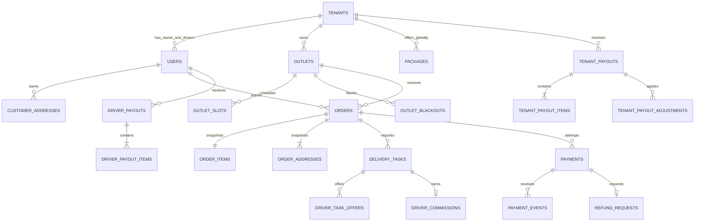
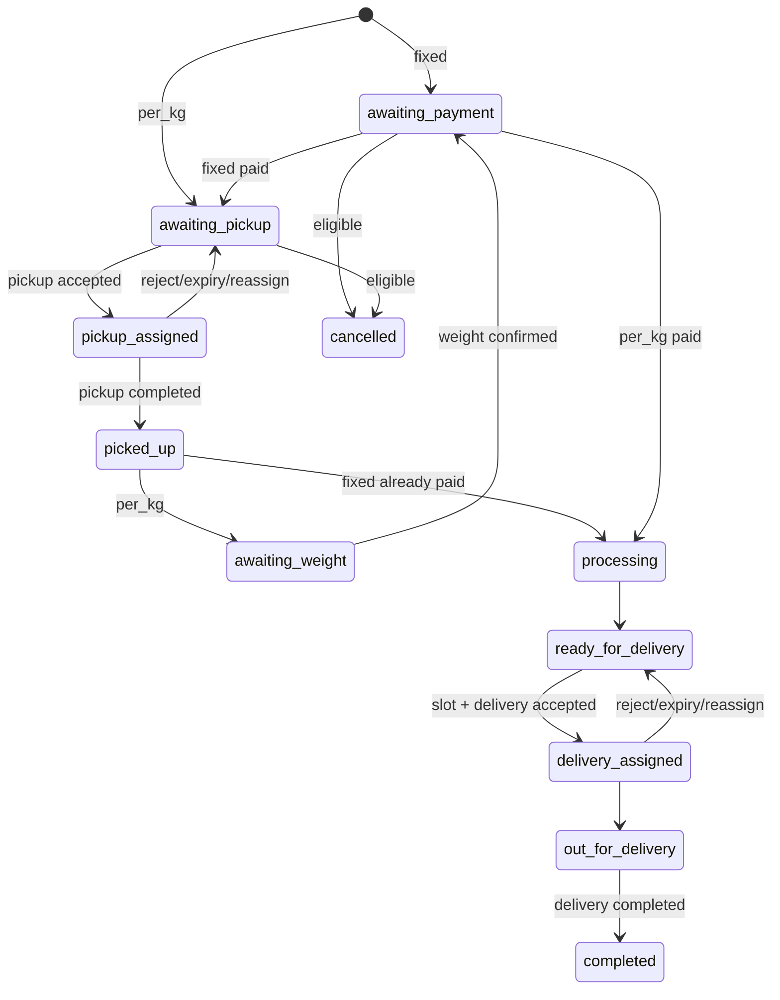

# Domain dan Data Model

> Source of truth bisnis: [`01-product-scope.md`](01-product-scope.md). Dokumen ini adalah logical model, bukan migration final. Nama column, tipe, constraint, dan index harus dibuktikan lewat migration serta test.

## Prinsip pemodelan

- PostgreSQL adalah source of truth untuk order, payment, payout, refund, commission, dan audit.
- Semua nominal uang disimpan sebagai integer rupiah; berat disimpan sebagai integer gram.
- Timestamp disimpan UTC dan dikonversi ke `Asia/Jakarta` pada jadwal, tampilan, serta report.
- Record tenant-owned memiliki `tenant_id` dan constraint yang mencegah referensi lintas Tenant.
- URL publik menggunakan `public_id` ULID; ULID bukan pengganti authorization.
- Harga, fee, alamat, nama paket, commission rate, dan rekening pada transaksi disnapshot.
- Data transaksi tidak di-hard-delete. Master data yang pernah direferensikan diarsipkan.

Eloquent Model hanya mendefinisikan table mapping, casts, relationships, dan scope teknis. Semua perhitungan, lifecycle, transition, eligibility, dan invariant berada di Service. Semua query/persistence Model dilakukan melalui Repository.

## Aggregate utama



Diagram menyederhanakan beberapa actor FK. Migration final tetap mendefinisikan setiap FK dan delete behavior secara eksplisit.

## Identity dan tenancy

| Table | Column penting | Constraint/index penting |
| --- | --- | --- |
| `tenants` | `id`, `public_id`, name/slug, `onboarding_status`, `operational_status`, alasan dan lifecycle timestamps, payout hold | unique public ID/slug; enum/check; index lifecycle |
| `users` | `id`, `public_id`, `tenant_id?`, `role`, `status`, identity/contact dan auth/2FA fields | unique email/public ID; index `(tenant_id, role, status)`; role-tenancy check |
| `tenant_payout_accounts` | Tenant ID, encrypted account fields, masked label, verification status dan actor/timestamps | satu current account; perubahan append/supersede |
| `customer_addresses` | Customer ID, label/contact/address/city/area, lat/lng, `is_default` | index Customer/area; satu default per Customer |
| `driver_invitations` | Tenant ID, email/phone, token hash, expiry/acceptance, inviter | token unique dan sekali pakai; tidak menyimpan plaintext token |

`onboarding_status` bernilai `pending`, `approved`, atau `rejected`. `operational_status` membedakan `inactive`, `active`, `suspended`, dan `closed`. Request closure menghentikan order baru; final `closed` hanya setelah obligation selesai.

MVP menggunakan satu role per user:

- `customer`: `tenant_id` null;
- `tenant_owner`: `tenant_id` wajib dan hanya satu owner aktif per Tenant;
- `driver`: `tenant_id` wajib dan hanya satu Tenant;
- `super_user`: `tenant_id` null dan hanya satu akun aktif dari command aman.

### Schema Milestone 2 yang terimplementasi

Migration M2 mempertahankan user legacy sebagai Customer aktif, melakukan backfill `public_id` ULID, dan membiarkan phone legacy nullable karena data yang tidak tersedia tidak boleh dikarang. Semua registration baru tetap mewajibkan phone. `role_slot` unik menegakkan satu owner per Tenant dan satu Super User; `auth_version` mencabut session lama ketika password/status berubah.

`tenants` menyimpan snapshot outlet awal hanya untuk onboarding. Outlet operasional dan readiness belum dibuat sebelum Milestone 3. Lifecycle yang diizinkan adalah pending/inactive menuju approved/active atau rejected/inactive; rejected dapat kembali pending melalui resubmission; approved active dapat suspended/reactivated; closure yang telah difinalkan menjadi terminal.

`tenant_payout_accounts` mengenkripsi nama holder dan nomor rekening menggunakan encrypted cast server-side. Browser hanya menerima bank, holder masked, nomor masked, dan verification status. Perubahan rekening menyupersede record lama serta membuat current record baru berstatus pending. `activity_logs` append-only pada Model dan hanya menyimpan metadata before/after yang aman tanpa password, TOTP, recovery code, telepon, atau data rekening.

## Outlet, catalog, dan scheduling

| Table | Column penting | Constraint/index penting |
| --- | --- | --- |
| `outlets` | Tenant/public IDs, name/address/city/area, lat/lng, radius, pickup/delivery fee, hours, status | radius `1..global max`; fee non-negative; index Tenant/status/area |
| `outlet_slots` | Outlet ID, pickup/delivery type, day-of-week, local start/end, active flag | start < end; unique natural schedule key |
| `outlet_blackouts` | Outlet ID, local date, reason, actor | unique `(outlet_id, date)` |
| `packages` | Tenant/public IDs, name, pricing type, unit price, minimum quantity/weight, duration, status | pricing-specific checks; index Tenant/status |
| `platform_settings` | global max radius, payment maintenance flag, version/update actor/time | known keys only; perubahan sensitif diaudit |
| `payment_channels` | provider/channel code, safe label, allowlist status, verification time | unique provider/channel |

Outlet `draft` hanya dapat menjadi `active` jika Tenant approved/active, rekening payout terverifikasi, profil/koordinat/radius/jam/slot lengkap, dan minimal satu paket Tenant aktif. Rule readiness berada di `ActivateOutletService`.

Paket berlaku pada seluruh outlet Tenant. Harga per outlet tidak tersedia. Package/outlet yang pernah dipakai hanya dapat diarsipkan.

### Schema Milestone 3 yang terimplementasi

Migration M3 membuat `outlets`, `outlet_operating_hours`, `outlet_slots`, `outlet_blackouts`, `packages`, dan `customer_addresses`. Snapshot outlet onboarding yang sudah ada dibackfill menjadi satu outlet `draft`; snapshot pada Tenant tetap dipertahankan sehingga rollback tidak kehilangan data. Registrasi Tenant baru langsung membuat outlet draft yang sama, sedangkan resubmission menyinkronkan draft awal.

Radius disimpan sebagai integer meter, nominal fee/harga sebagai integer rupiah, durasi paket sebagai integer menit, dan koordinat sebagai decimal tujuh digit. Default address memakai nullable unique owner key agar invariant satu default per Customer portable di SQLite/PostgreSQL. Deaktivasi outlet/package adalah `active -> draft`; archive hanya dari draft dan terminal.

SQLite local tidak menyediakan fungsi trigonometri secara konsisten. Repository discovery memakai bounding query lalu Haversine dan pagination di PHP untuk SQLite; PostgreSQL menghitung/filter/sort Haversine di SQL. Kedua jalur memakai eligibility dan hasil presentasi yang sama serta diuji pada CI masing-masing.

## Orders

| Table | Column penting | Constraint/index penting |
| --- | --- | --- |
| `orders` | Tenant/outlet/Customer IDs, public/order number, fulfillment/payment status, pickup/delivery ranges, indicator, money, weight, processing/target/readiness, completion/cancellation | unique identifiers; FKs; index Customer/Tenant/outlet/status/date |
| `order_items` | Order/package ID, package/pricing snapshot, unit price, integer quantity, minimum/actual/billable weight, subtotal | unique `order_id` karena satu paket |
| `order_addresses` | Order ID, pickup/delivery type, contact/address/city/area snapshot, lat/lng | unique `(order_id, type)` |
| `order_status_histories` | Order ID, from/to status, actor, reason/note, timestamp | append-only; index order/time |
| `order_schedule_histories` | Order ID, slot/range lama dan baru, actor, alasan, timestamp | append-only; index order/time |
| `order_indicators` | Order ID, type, active key, context aman, detected/resolved timestamp | satu indicator aktif per order/type |
| `weight_confirmations` | Order ID, actual/minimum/billable grams, rounding, totals, actor/time, optional proof key, access-expiry/revocation, current/superseded marker | partial unique untuk satu current confirmation; koreksi tetap diaudit |

Money breakdown minimum adalah `items_subtotal`, `pickup_fee`, `delivery_fee`, dan `grand_total`. Fixed package memakai integer quantity. Per-kg memakai `max(actual, minimum)` lalu dibulatkan naik per 100 gram; harga per kg wajib habis dibagi 10 agar hasil setiap 100 gram tetap integer rupiah. Service menetapkan formula dan hasil.

Indicator `delayed`, `pickup_delayed`, `delivery_delayed`, dan `awaiting_customer` bukan fulfillment state. Simpan detected/resolved timestamps dan reason/context.

### Schema Milestone 4 yang terimplementasi

Migration M4 membuat aggregate `orders`, item/alamat snapshot, append-only status/schedule history, dan incident indicator. Nomor order serta public ID unik; `(customer_id, idempotency_key)` mencegah duplicate submit. Foreign key master memakai `restrict`, sedangkan child aggregate hanya mengikuti lifecycle Order yang tidak memiliki hard-delete use case.

Fixed order menyimpan subtotal dan grand total final. Per-kg hanya menyimpan optional estimated weight, billable estimate per 100 gram, serta estimated subtotal/total; actual weight dan invoice final tetap M5/M6. Tenant/outlet/package/fee/alamat/jadwal disnapshot sehingga perubahan master tidak mengubah presentasi transaksi lama.

## Dispatch dan Driver commission

| Table | Column penting | Constraint/index penting |
| --- | --- | --- |
| `tenant_driver_settings` | Tenant ID, pickup/delivery commission nullable, change timestamp | unique Tenant; `null` memblokir offer, zero eksplisit valid |
| `driver_invitations` | Tenant/inviter IDs, public ID, email/phone, token hash, expiry/accepted/revoked timestamps | satu pending invitation per Tenant/email melalui nullable unique key |
| `driver_profiles` | User Driver/Tenant IDs, availability | unique User; Driver hanya satu Tenant |
| `delivery_tasks` | Tenant/order/outlet IDs, type, assignee, status, commission snapshot, schedule/lifecycle timestamps, proof/note, proof access-expiry/revocation | unique `(order_id, type)`; tenant-consistent FKs; index assignee/status |
| `driver_task_offers` | Task/Driver IDs, status, offered/expires/responded timestamps | satu offer aktif per task; expiry 10 menit |
| `driver_task_histories` | Task, from/to status, actor, reason/note, timestamp | append-only |
| `driver_commissions` | Tenant/task/Driver IDs, amount snapshot, status, earned/paid timestamps | unique task; non-negative; index Driver/status/earned |
| `driver_payouts` | Tenant/Driver IDs, reference, cutoff, total, method/reference/note, lifecycle timestamps | unique reference; total non-negative |
| `driver_payout_items` | Payout/commission IDs, amount snapshot | commission hanya pada satu finalized payout |

Availability Driver `available`/`unavailable` terpisah dari account status. Partial unique constraint atau enforcement transaction-safe memastikan satu Driver hanya mempunyai satu task `accepted`/`in_progress`.

Task status adalah `pending`, `offered`, `accepted`, `in_progress`, `completed`, atau `cancelled`. `cancelled` terminal dipakai untuk pembatalan order yang tidak boleh dipalsukan sebagai pending atau completed. M7 membuka delivery completion; task, commission `earned`, order `completed`, history, privacy revocation, dan proof-retention timestamp ditulis dalam transaction yang sama.

Commission disnapshot saat task diberikan dan menjadi `earned` tepat sekali ketika task selesai. Batch mengambil seluruh commission eligible sampai cutoff; membership ditentukan Service, bukan request client.

## Payment, refund, dan Tenant payout

| Table | Column penting | Constraint/index penting |
| --- | --- | --- |
| `payments` | Tenant/order IDs, public/merchant order IDs, nullable active-order key, provider/channel, amount/status, reconciliation status, provider reference/URL, expiry/result timestamps, actual fee | unique merchant order ID/provider reference/active-order key; index order/status/paid |
| `payment_events` | Payment ID?, event fingerprint, provider status/reference/amount, signature result, safe payload, processing timestamps | unique fingerprint; tanpa secret/PII tak perlu |
| `refund_requests` | Tenant/order/payment IDs, status, immutable amount/reason, actor/timestamps, external reference | maksimal satu completed refund per payment |
| `financial_adjustments` | Tenant/payment/refund IDs, type, signed amount, reason, actor/time, settlement state | append-only; index Tenant/state/date |
| `tenant_payouts` | Tenant ID, reference/cutoff/status, gross/fee/adjustment/net, account snapshot, lifecycle timestamps | unique reference; finalized immutable |
| `tenant_payout_items` | Payout/payment IDs, gross/fee/net snapshots | payment hanya pada satu finalized payout |
| `tenant_payout_adjustments` | Payout/financial-adjustment IDs, signed amount snapshot | adjustment hanya diselesaikan pada satu finalized payout |

Order payment status adalah `unpaid`, `pending`, `paid`, `failed`, dan `expired`. Ketidakpastian provider disimpan sebagai reconciliation state internal seperti `needs_inquiry`; UI menampilkan “sedang diverifikasi”, bukan status bisnis baru.

Satu order dapat memiliki attempt baru setelah failure/expiry, tetapi hanya satu attempt aktif dan satu successful payment. Gunakan transaction, row lock, unique key, dan partial unique index bila sesuai. Callback duplicate/out-of-order tidak boleh menurunkan `paid` atau menggandakan side effect.

### Schema dan flow Milestone 6 yang terimplementasi

Migration korektif M6 menambahkan `active_order_key` nullable dan unique serta timestamp cooldown inquiry. Backfill hanya menandai attempt `pending` serta gagal aman bila menemukan lebih dari satu attempt aktif existing untuk order yang sama. Transition `paid`, `failed`, atau `expired` selalu membersihkan key; terminal `failed`/`expired` tidak dapat hidup kembali melalui callback terlambat.

`payment_events` tetap append-only dan menyimpan fingerprint/status aman tanpa raw callback, signature, credential, payment URL, atau PII. Actual provider fee nullable sampai callback/inquiry tervalidasi menyediakannya. Status attempt, status pembayaran order, dan reconciliation dipertahankan terpisah.

Refund tidak mengubah payment asli dari `paid`. Refund penuh yang selesai menghasilkan adjustment negatif. Jika payment sudah dipayout, adjustment dibawa ke payout berikutnya. Automated/partial provider refund di luar MVP.

Payment eligible untuk payout jika order `completed` lebih dari 3×24 jam, payment tetap `paid`, fee aktual direkonsiliasi, dan tidak ada refund aktif. Batch mengambil seluruh payment eligible Tenant sampai cutoff. Net tidak positif tidak dapat difinalisasi sebagai transfer normal.

## Notification, audit, dan privacy

| Table | Column penting | Constraint/index penting |
| --- | --- | --- |
| `notifications` | schema database notification Laravel dengan payload minimal dan dedupe key | unique dedupe key; index recipient/read/created |
| `activity_logs` | Tenant?, actor, action, subject, reason, safe before/after metadata, timestamp | append-only; index subject/actor/Tenant/time |
| `pii_access_logs` | Super User, order/Customer target, reason, grant/expiry/access timestamps | append-only dan order-specific |

Audit wajib untuk lifecycle Tenant, payout account/hold/finalization, payment inquiry, refund, Driver payout, reschedule/cancel sesudah assignment, dan PII reveal. Jangan menyimpan password, TOTP secret, token, signature, raw callback, atau signed URL.

Tenant melihat contact Customer sampai 3×24 jam setelah completion. Driver melihatnya setelah accept sampai task selesai. Super User mendapat masked PII secara default; reveal memerlukan alasan dan expiry.

## State machines

### Fulfillment



Transition map berada di Service dan memvalidasi actor, state, payment, task, slot, serta required data dalam transaction. Super User tidak mempunyai generic override.

### Payment attempt

```text
pending -> paid | failed | expired
pending + uncertain response -> pending + needs_inquiry
failed/expired -> new attempt
paid -> paid for duplicate/out-of-order callback
```

Attempt berakhir setelah 60 menit. Inquiry tervalidasi hanya mengubah state secara monotonic. Redirect browser tidak pernah mengubah state.

### Driver task dan offer

```text
offer: offered -> accepted | rejected | expired | withdrawn
task:  pending -> offered -> accepted -> in_progress -> completed
task:  offered/accepted -> pending melalui cancel/reassign yang diaudit
```

Penerimaan atomic. Satu task hanya ditawarkan kepada satu Driver dan satu Driver hanya memiliki satu task aktif.

### Refund

```text
submitted -> approved -> completed
submitted -> rejected
approved -> rejected hanya melalui koreksi terkontrol sebelum transfer
```

Submit paling lambat 3×24 jam setelah order `completed`. Amount sama dengan payment paid dan tidak dapat diedit.

## Repository boundary dan query utama

Repository tidak memutuskan eligibility atau transition. Service memberikan trusted context/criteria dan menafsirkan hasil; Repository menjalankan tenant-scoped query, eager loading, aggregate, lock, dan persistence.

- Customer orders: `(customer_id, created_at desc)`.
- Tenant board: `(tenant_id, fulfillment_status, created_at desc)`.
- Outlet workload: `(outlet_id, fulfillment_status, scheduled_at)`.
- Driver offers/tasks: `(driver_id, status, expires_at/scheduled_at)`.
- Tenant finance: payment `(tenant_id, paid_at)` plus payout/refund/adjustment state.
- Driver finance: commission `(tenant_id, driver_id, status, earned_at)`.
- Notification/audit: recipient atau subject plus descending timestamp.

Gunakan eager loading, column selection, dan pagination. CSV dibatasi 5.000 baris dan 90 hari. Jalankan `EXPLAIN ANALYZE` pada seed representatif sebelum menambah index spekulatif.

## Retention dan deletion

- Proof task/timbangan dihapus 90 hari setelah order dan seluruh refund terkait selesai; metadata dipertahankan.
- Customer hanya dianonimkan setelah tidak ada order/payment/refund aktif; record transaksi minimum tetap ada.
- Tenant closure tidak menghapus order, finance, atau audit.
- Retention finansial/PII final harus divalidasi legal sebelum production.
- Hard delete hanya untuk draft master data yang belum pernah direferensikan dan telah melewati authorization Service.
