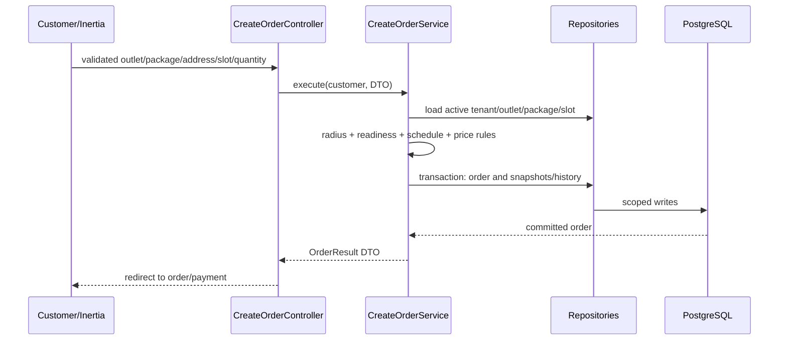
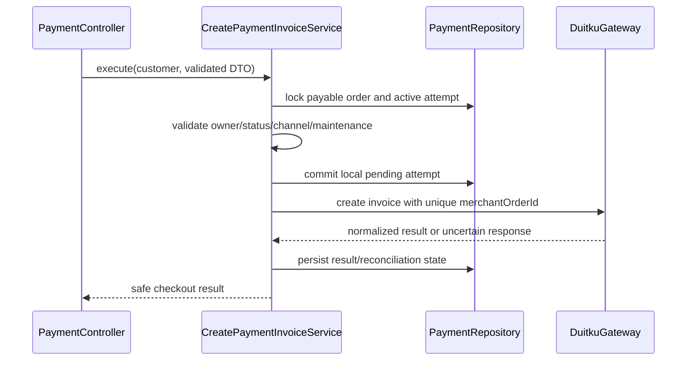

# Core Flows dan Integrasi

> Seluruh flow mengikuti [`01-product-scope.md`](01-product-scope.md) dan dependency rule [`02-architecture.md`](02-architecture.md). Controller tidak menjalankan business rule atau query; setiap flow masuk ke Service dan seluruh akses entity melalui Repository.

## Contract implementasi setiap flow

```text
Form Request: authorize actor + validate bentuk/range input
Controller:    buat DTO, call satu Service, bentuk response
Service:       ownership + invariant + calculation + transaction + event
Repository:    scoped query + lock + persistence + pagination/aggregate
Gateway:       komunikasi provider eksternal tanpa business decision
```

Validasi format di Form Request tidak menggantikan validasi bisnis di Service. Contoh: format koordinat divalidasi Form Request; apakah alamat berada dalam radius outlet diputuskan Service berdasarkan entity yang dimuat Repository.

## 1. Tenant onboarding dan outlet readiness

1. Calon Tenant mendaftar dengan data usaha minimum dan owner ber-email terverifikasi.
2. `RegisterTenantService` membuat Tenant `pending` dan satu owner tanpa mengaktifkan operasi.
3. Super User meninjau melalui `ReviewTenantApplicationService`; approval/rejection membutuhkan alasan dan audit.
4. Owner yang approved wajib setup TOTP dan mengajukan rekening payout.
5. Super User memverifikasi rekening tanpa mengedit datanya.
6. Tenant melengkapi outlet, fees, jam, slots, blackout, radius, dan minimal satu paket aktif.
7. `ActivateOutletService` menghitung readiness dan hanya mengaktifkan outlet jika seluruh syarat terpenuhi.

Repository khusus Super User tidak boleh memakai global unscoped query generik. Service support meminta target eksplisit, menerapkan PII masking, dan mencatat audit.

Tenant suspended/closing tidak menerima order baru, tetapi order berjalan tetap dapat diselesaikan. Closure final menunggu order, refund, payout, dan adjustment selesai.

## 2. Menemukan outlet

Input publik dibatasi pada area/name filter, pricing type, serta koordinat bila Customer memberi consent. Form Request memvalidasi latitude `-90..90`, longitude `-180..180`, dan ukuran/range filter.

`SearchOutletService` memuat global radius cap dan membentuk `OutletSearchCriteria` dari rule lifecycle Tenant, readiness outlet, package availability, serta `service_radius_m`. `OutletRepositoryInterface` menerjemahkan criteria tersebut menjadi bounding/Haversine query, sorting, dan pagination. Dengan demikian Service memiliki keputusan eligibility, sedangkan Repository hanya mengeksekusi query teknis secara efisien.

Implementasi M3 memakai SQL Haversine pada PostgreSQL. Karena build SQLite PHP lokal tidak menjamin extension matematika, jalur SQLite mengambil kandidat dari bounding box lalu menghitung, memfilter, mengurutkan, dan memaginasi hasil di Repository. Batas global 20 km serta profil awal 20 outlet menjaga jalur local-first tetap terbatas; PostgreSQL tetap jalur production.

Jika location permission ditolak, Customer boleh browse berdasarkan kota/area tanpa jarak. Order tidak dapat dibuat sebelum koordinat pickup dan delivery tersedia serta keduanya lolos radius. UI menyebut jarak sebagai perkiraan garis lurus, bukan driving distance/ETA.

M3 menyediakan detail outlet yang mengevaluasi dua alamat tersimpan milik Customer sebagai order candidate tanpa membuat Order. Koordinat browser hanya dikirim setelah consent eksplisit dan tidak disimpan otomatis.

## 3. Membuat order dan scheduling



Business rules Service:

- Customer wajib login dan email verified; `tenant_id`, Customer ID, price, fee, total, dan status tidak dipercaya dari input.
- Satu order memiliki satu Tenant, satu outlet, satu paket, satu pickup address, dan satu delivery address.
- Kedua alamat harus berada dalam radius outlet; delivery default memakai pickup address.
- Slot mengikuti `Asia/Jakarta`, minimum lead time dua jam, horizon tujuh hari, outlet hours, dan blackout.
- Tidak ada capacity planning; validitas slot tidak berarti reservasi kuota.
- Order otomatis diterima jika seluruh readiness rule lulus.
- Fixed: integer quantity, total langsung final, status `awaiting_payment`; pemilihan dan persistence channel payment baru tersedia pada M6.
- Per-kg: estimate Customer opsional, belum menjadi tagihan, status `awaiting_pickup`.
- Harga/package/address/fees disnapshot dalam transaction.
- Idempotency key/form token mencegah double submit tanpa mengandalkan disabled button.
- Event/notifikasi baru ditambahkan saat consumer nyata tersedia pada M5/M7; M4 tidak membuat event placeholder.

Customer dapat memiliki beberapa order aktif. Setiap order mempunyai payment, task, dan payout lifecycle independen.

Implementasi M4 memakai unique idempotency key per Customer dan fingerprint payload. Retry dengan key/payload sama mengembalikan aggregate lama; reuse key dengan payload berbeda ditolak. Customer dan Tenant mendapat list/detail/filter, timeline, reschedule/cancel terkontrol, serta receipt skeleton tanpa field provider palsu. Monitoring lima-menitan membuat dan menyelesaikan indicator secara idempotent melalui Service.

## 4. Pickup, offer Driver, timbang, dan delay

1. `OfferDriverTaskService` hanya memilih Driver Tenant yang aktif, `available`, tidak memiliki task aktif, dan menerima commission snapshot.
2. Satu task hanya memiliki satu active offer. `AcceptDriverTaskService` melakukan lock/conditional update; offer berakhir dalam 10 menit.
3. Offer menampilkan outlet, slot, area, task type, commission, dan approximate distance tanpa contact lengkap.
4. Setelah accept, Driver mendapat contact/alamat sampai task selesai.
5. Driver menjalankan transition `accepted -> in_progress -> completed`; actor/timestamp wajib, note/foto opsional.
6. Pickup completion membuat order `picked_up`; fixed yang sudah paid dapat menuju processing, per-kg menuju `awaiting_weight`.
7. `ConfirmLaundryWeightService` menyimpan actual gram, menerapkan minimum, membulatkan naik per 100 gram, menghitung total, dan membuat history.
8. Setelah berat terkunci, per-kg menjadi `awaiting_payment` dan Customer memilih channel.

Foto timbangan/task berada pada private storage dengan authorized temporary access. Repository hanya menyimpan object key/metadata; upload validation berada di Form Request dan business attachment rule berada di Service.

Jika slot lewat tanpa Driver, monitoring Service memberi indicator `pickup_delayed` atau `delivery_delayed`; fulfillment state tidak berubah dan tidak ada auto cancel/refund. Tenant memilih slot baru dengan alasan dan Service mengirim notifikasi.

Customer boleh reschedule sebelum Driver accept. Sesudah accept, hanya Tenant dapat reschedule dengan reason serta explicit cancel/reassign. Seluruh perubahan schedule diaudit.

## 5. Integrasi Duitku

### Boundary

`PaymentGatewayInterface` mendefinisikan create invoice dan status inquiry. `DuitkuGateway` menggunakan Laravel HTTP client untuk mapping/signature/timeout/safe logging. Gateway tidak menentukan apakah order payable atau status mana yang boleh berubah; keputusan tersebut milik Service.

Channel Customer adalah intersection antara global allowlist Super User, channel aktif merchant Duitku, QRIS/E-Wallet scope, serta availability untuk amount. Tenant tidak mengubah channel. Satu merchant account platform digunakan setelah persetujuan Duitku dan validasi legal/operasional.

Rujukan implementasi harus diverifikasi kembali terhadap [Duitku POP API resmi](https://docs.duitku.com/pop/id/) pada saat coding; jangan menyalin formula, header, atau status dari ingatan.

### Create invoice



Jangan menahan transaction selama network call. Attempt berakhir 60 menit dan `merchantOrderId` mereferensikan attempt. Hanya satu attempt aktif per order. Jika response hilang setelah provider mungkin menerima request, attempt tetap pending dengan `needs_inquiry`; jangan langsung membuat attempt kedua.

Payment maintenance menolak create-invoice baru, tetapi tidak menolak order creation, callback, atau reconciliation attempt lama.

### Callback sebagai source of truth

Callback Controller menerima request terbatasi dan memanggil `ProcessDuitkuCallbackService`; tidak melakukan signature check atau mutation sendiri. Service memakai Gateway verifier/normalizer dan Repository untuk:

1. memvalidasi signature secara constant-time, merchant, amount, order ID, provider/reference, content type, serta required fields;
2. menyimpan safe event fingerprint tanpa secret/raw PII;
3. me-lock payment/order dalam transaction;
4. membuat duplicate event atau callback setelah `paid` menjadi no-op sukses;
5. menerapkan transition monotonic dan tidak pernah menurunkan `paid`;
6. menjalankan side effect tepat sekali;
7. commit sebelum notification/broadcast;
8. mengembalikan acknowledgement yang sesuai provider.

Endpoint callback publik mendapat CSRF exception spesifik. IP allowlist hanya defense tambahan, bukan pengganti signature. Return URL/JS callback hanya membuka halaman status dan tidak pernah mengubah payment; lihat [Duitku redirect guidance](https://docs.duitku.com/api/id/#redirect).

### Reconciliation dan failure

- Inquiry hanya untuk response tidak pasti, support action, atau reconciliation; jangan polling semua payment secara agresif.
- Redirect sebelum callback tetap menampilkan pending/“sedang diverifikasi” dengan polling/realtime.
- Signature/amount/merchant mismatch tidak memutasi payment dan membuat security/reconciliation event.
- Expired/failed attempt dapat diganti attempt baru; attempt lama tidak dihidupkan.
- Daily reconciliation memisahkan gross dan actual fee. Fee unknown tidak dianggap nol.
- Super User tidak dapat menandai payment `paid` secara manual.

## 6. Processing, delivery, dan completion

- Hanya payment `paid` dari callback/inquiry tervalidasi yang mengizinkan `StartOrderProcessingService`.
- Saat masuk processing, Service menghitung estimated completion. Jika terlewati, indicator `delayed` dan notifikasi dibuat tanpa state/penalty otomatis.
- Tenant menandai `ready_for_delivery`; Customer lalu memilih delivery slot dengan lead time dua jam dan horizon tujuh hari sejak readiness.
- Tanpa pilihan dalam tujuh hari, state tetap `ready_for_delivery` dengan indicator `awaiting_customer`; tidak ada storage fee.
- Delivery task baru dapat ditawarkan setelah slot dipilih.
- `CompleteDriverTaskService` secara atomic menyelesaikan task, membuat commission idempotent, mengubah order ke `completed`, mencabut contact access, dan menerbitkan event.
- Tidak ada konfirmasi penerimaan tambahan atau live GPS.

## 7. Realtime dan notification

Timeline database adalah source of truth:

1. Service menyimpan transition/history dalam transaction.
2. Event domain di-dispatch after commit.
3. Queued listener membuat database notification dan private broadcast.
4. React/Echo memperbarui status atau melakukan Inertia partial reload.
5. Polling konservatif aktif saat WebSocket gagal dan berhenti pada state terminal.

Payment notification hanya invoice ready, paid, failed, dan expired. Email hanya untuk auth, bukan status order. Payload tidak membawa Model penuh, alamat, telepon, signature, atau provider error.

## 8. Cancellation dan full refund

- Customer self-cancel hanya ketika payment belum `paid` dan pickup belum diterima Driver.
- Setelah Driver accept, cancellation hanya oleh Tenant melalui Service, state yang valid, reason, task handling, dan audit.
- Order paid tidak dibatalkan melalui mutation biasa; pengembalian dana memakai full-refund workflow.
- Customer menghubungi outlet di luar aplikasi. Tenant mengajukan request maksimal 3×24 jam setelah completion.
- `SubmitRefundRequestService` mengambil amount immutable dari payment paid.
- Super User approve/reject dengan reason, lalu menandai completed setelah transfer manual memiliki reference.
- Payment asli tetap `paid`; completion membuat negative adjustment.
- Jika payment sudah dipayout, adjustment masuk payout berikutnya.
- Commission task yang selesai tetap earned/paid.

Refund status: `submitted -> approved -> completed` atau `submitted -> rejected`. Automated dan partial Duitku refund tidak termasuk MVP.

## 9. Laporan dan payout Tenant

Tenant report menggunakan filter maksimal 90 hari, maksimal 5.000 row untuk CSV, optional outlet, dan definisi tanggal yang terlihat:

```text
gross_paid              = payment paid menurut paid_at
gateway_fee_actual      = fee provider yang sudah direkonsiliasi
net_after_gateway_fee   = gross_paid - gateway_fee_actual
driver_commission       = commission menurut earned_at
financial_adjustment    = refund/adjustment pada periodenya
net_operational         = gross - fee - commission
settlement_movement     = net_after_gateway_fee + financial_adjustment
```

`net_operational` bukan laba akuntansi dan tidak menyerap refund/adjustment ke dalam definisinya. `settlement_movement` membantu rekonsiliasi payout, bukan laba. Platform service fee bernilai nol pada MVP. Report Service meminta aggregate/read DTO dari Repository; Controller tidak membangun query atau formula.

Payment eligible untuk payout setelah completion + 3×24 jam, tetap paid, actual fee tersedia, dan tidak ada refund aktif. `CreateTenantPayoutService` mengambil seluruh eligible payment Tenant sampai cutoff. Final record menyimpan gross/fee/adjustment/net dan snapshot rekening. Payout hold memblokir finalization, bukan operasi laundry.

Super User mencatat transfer manual. Final payout immutable; koreksi memakai adjustment/audit. Tenant hanya membaca payout miliknya.

CSV di-stream setelah authorization, menetralisasi formula yang dimulai `=`, `+`, `-`, atau `@`, tidak disimpan publik, serta tidak membawa PII reveal.

## 10. Komisi dan payout Driver

- Commission fixed per pickup/delivery leg disnapshot saat task diberikan.
- Completion membuat satu commission `earned` melalui unique task constraint.
- Commission langsung eligible setelah task selesai dan tidak menunggu order/refund.
- Tenant membuat batch per Driver sampai cutoff; Service mengambil seluruh earned-unpaid commission.
- Transfer terjadi di luar sistem; Tenant finalisasi dengan amount, method, reference/note, actor, dan timestamp.
- Driver hanya melihat earned/paid miliknya; refund tidak membalik commission.

## 11. Sensitive support actions

Action berikut memerlukan Service khusus, reason, re-authentication jika sensitive auth lebih dari 15 menit, dan append-only audit:

- Tenant approval/suspension/closure dan session revocation;
- payout account verification/change serta payout hold;
- payment inquiry dan notification resend;
- refund approval/completion;
- Tenant/Driver payout finalization;
- time-limited PII reveal.

Super User tidak boleh impersonate, mengedit credential/profile user, melakukan generic order/payment override, atau mengekspor revealed PII.
