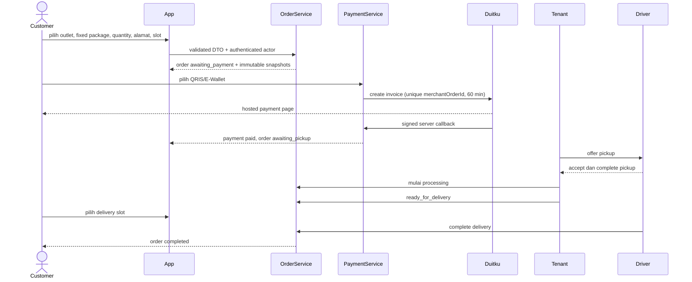
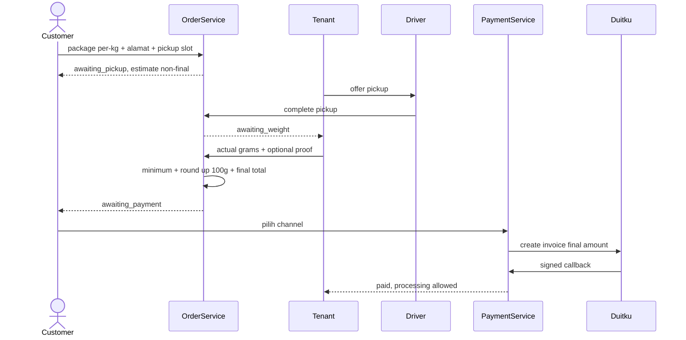
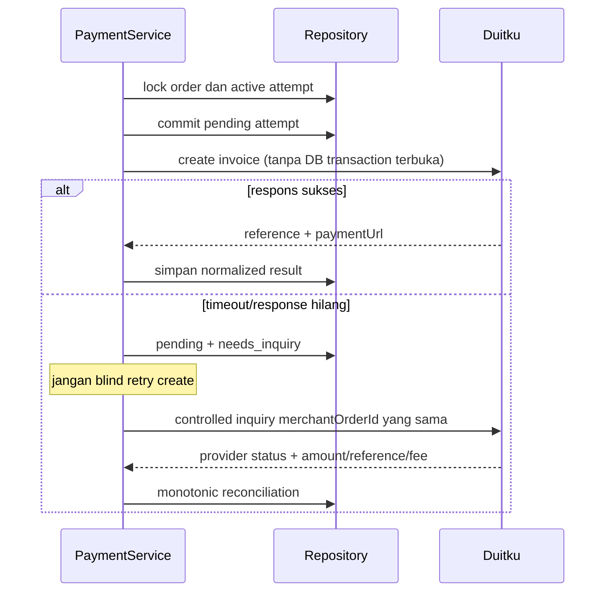
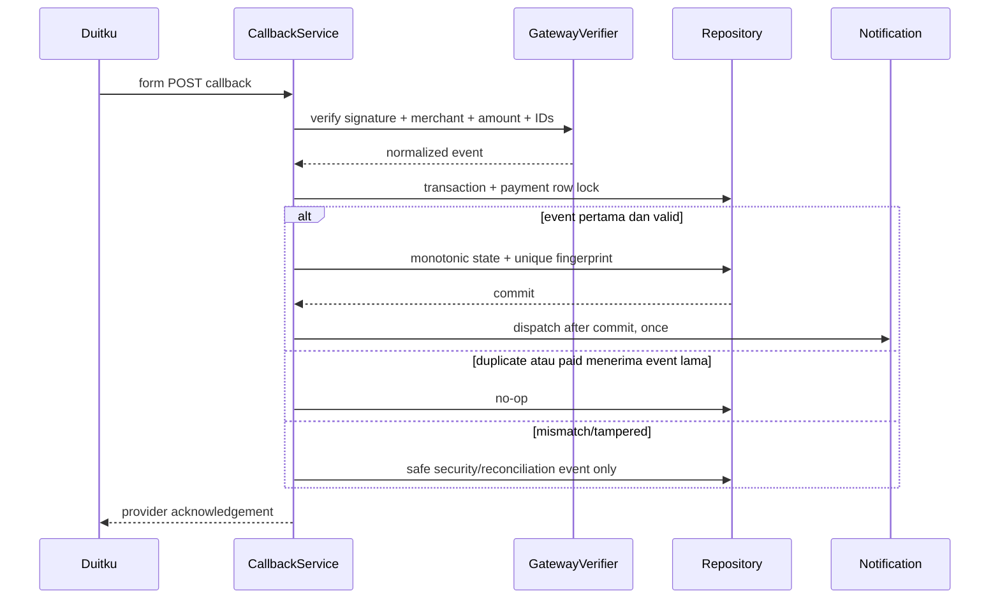
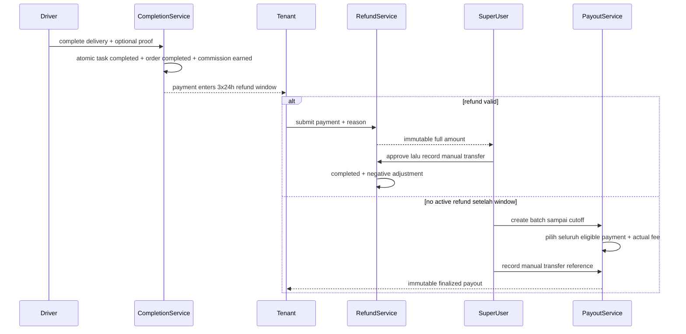

# Sequence Diagrams Milestone 0

## Fixed order

```mermaid
sequenceDiagram
    actor Customer
    participant App
    participant OrderService
    participant PaymentService
    participant Duitku
    participant Tenant
    participant Driver

    Customer->>App: pilih outlet, fixed package, quantity, alamat, slot
    App->>OrderService: validated DTO + authenticated actor
    OrderService-->>App: order awaiting_payment + immutable snapshots
    Customer->>PaymentService: pilih QRIS/E-Wallet
    PaymentService->>Duitku: create invoice (unique merchantOrderId, 60 min)
    Duitku-->>Customer: hosted payment page
    Duitku->>PaymentService: signed server callback
    PaymentService-->>App: payment paid, order awaiting_pickup
    Tenant->>Driver: offer pickup
    Driver-->>Tenant: accept dan complete pickup
    Tenant->>OrderService: mulai processing
    Tenant->>OrderService: ready_for_delivery
    Customer->>App: pilih delivery slot
    Driver->>OrderService: complete delivery
    OrderService-->>Customer: order completed
```

## Per-kg order

```mermaid
sequenceDiagram
    actor Customer
    participant OrderService
    participant Tenant
    participant Driver
    participant PaymentService
    participant Duitku

    Customer->>OrderService: package per-kg + alamat + pickup slot
    OrderService-->>Customer: awaiting_pickup, estimate non-final
    Tenant->>Driver: offer pickup
    Driver->>OrderService: complete pickup
    OrderService-->>Tenant: awaiting_weight
    Tenant->>OrderService: actual grams + optional proof
    OrderService->>OrderService: minimum + round up 100g + final total
    OrderService-->>Customer: awaiting_payment
    Customer->>PaymentService: pilih channel
    PaymentService->>Duitku: create invoice final amount
    Duitku->>PaymentService: signed callback
    PaymentService-->>Tenant: paid, processing allowed
```

## Create invoice, timeout, dan inquiry

```mermaid
sequenceDiagram
    participant PaymentService
    participant Repository
    participant Duitku

    PaymentService->>Repository: lock order dan active attempt
    PaymentService->>Repository: commit pending attempt
    PaymentService->>Duitku: create invoice (tanpa DB transaction terbuka)
    alt respons sukses
        Duitku-->>PaymentService: reference + paymentUrl
        PaymentService->>Repository: simpan normalized result
    else timeout/response hilang
        PaymentService->>Repository: pending + needs_inquiry
        Note over PaymentService: jangan blind retry create
        PaymentService->>Duitku: controlled inquiry merchantOrderId yang sama
        Duitku-->>PaymentService: provider status + amount/reference/fee
        PaymentService->>Repository: monotonic reconciliation
    end
```

## Callback duplicate dan out-of-order

```mermaid
sequenceDiagram
    participant Duitku
    participant CallbackService
    participant GatewayVerifier
    participant Repository
    participant Notification

    Duitku->>CallbackService: form POST callback
    CallbackService->>GatewayVerifier: verify signature + merchant + amount + IDs
    GatewayVerifier-->>CallbackService: normalized event
    CallbackService->>Repository: transaction + payment row lock
    alt event pertama dan valid
        CallbackService->>Repository: monotonic state + unique fingerprint
        Repository-->>CallbackService: commit
        CallbackService->>Notification: dispatch after commit, once
    else duplicate atau paid menerima event lama
        CallbackService->>Repository: no-op
    else mismatch/tampered
        CallbackService->>Repository: safe security/reconciliation event only
    end
    CallbackService-->>Duitku: provider acknowledgement
```

## Delivery completion, refund, dan payout

```mermaid
sequenceDiagram
    participant Driver
    participant CompletionService
    participant Tenant
    participant RefundService
    participant SuperUser
    participant PayoutService

    Driver->>CompletionService: complete delivery + optional proof
    CompletionService->>CompletionService: atomic task completed + order completed + commission earned
    CompletionService-->>Tenant: payment enters 3x24h refund window
    alt refund valid
        Tenant->>RefundService: submit payment + reason
        RefundService-->>SuperUser: immutable full amount
        SuperUser->>RefundService: approve lalu record manual transfer
        RefundService->>RefundService: completed + negative adjustment
    else no active refund setelah window
        SuperUser->>PayoutService: create batch sampai cutoff
        PayoutService->>PayoutService: pilih seluruh eligible payment + actual fee
        SuperUser->>PayoutService: record manual transfer reference
        PayoutService-->>Tenant: immutable finalized payout
    end
```
