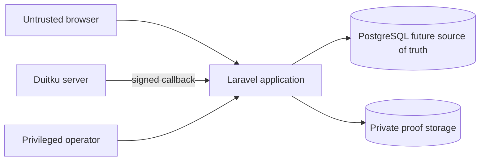

# Threat Model Awal

## Trust boundaries dan assets

Assets utama adalah Tenant-owned records, payment status, payout account/batch, Customer PII, proof file, credential provider, dan audit trail. Browser, callback public internet, uploaded file, dan privileged operator input tetap dianggap tidak terpercaya.

## Risk register

| ID | Threat | Likelihood | Impact | Mitigation minimum | Verification | Residual risk / owner |
| --- | --- | --- | --- | --- | --- | --- |
| TM-01 | IDOR/cross-Tenant read atau mutation | High | Critical | Tenant context dari actor, scoped repository fail-closed, Service ownership check, composite constraints | Cross-Tenant HTTP/Service/Repository tests M2–M6 | Bug pada entry point baru; Engineering |
| TM-02 | Callback forged/tampered | High | Critical | HMAC constant-time, expected merchant/amount/order/reference, body/content-type limit, no redirect mutation | Invalid signature/mismatch tests M6 + live sandbox | Provider contract drift; Engineering/Duitku |
| TM-03 | Callback replay/duplicate/out-of-order/concurrent | High | Critical | Unique fingerprint, row lock, nullable unique active-attempt key, terminal/monotonic transition | DB callback tests M6; guarded live replay tetap wajib | Provider retry behavior; Engineering |
| TM-04 | Lost create response memicu double charge/attempt | Medium | High | Persist pending before call, `needs_inquiry`, no blind retry, single active attempt | HTTP fake M6; live fault-injection tetap wajib | Provider response ambiguity; Engineering |
| TM-05 | Payout batch dimanipulasi client | Medium | Critical | Membership dipilih Service sampai cutoff, actual fee required, immutable final batch | Service and repository integration tests M8 | Satu Super User tanpa four-eyes; Finance/Security |
| TM-06 | Payout account diganti untuk fraud | Medium | Critical | Re-auth, reason, audit, re-verification, payout hold, historical snapshot | Authorization/re-auth/encryption/audit tests M2; payout transaction M8 | Social engineering; Operations/Security |
| TM-07 | PII reveal disalahgunakan | Medium | High | Masked default, order-specific grant, reason, expiry, audit, no export | Policy/service/browser tests M2/M9 | Insider misuse; Security/Legal |
| TM-08 | Driver/Tenant menyimpan contact terlalu lama | Medium | High | Server-side privacy windows and revocation; payload minimization | Assignment/completion/reassign/cancel visibility tests M5 | Screenshot di luar sistem; Legal/Operations |
| TM-09 | Malicious proof upload/XSS/path traversal | High | High | Raster allowlist, content MIME/dimension/size validation, generated object key, private storage, no SVG/HTML | MIME/size/private URL/orphan cleanup tests M5; fuzz M9 | Image parser vulnerability; Engineering |
| TM-10 | Proof/PII retained terlalu lama | Medium | High | 90-day proof cleanup rule, anonymization workflow, retention schedule | Cleanup eligibility tests + operational audit | Legal period belum final; Legal blocker RB-003 |
| TM-11 | Secret bocor ke frontend/log/evidence | Medium | Critical | Server env only, redact logs, no raw callback/payment URL, secret scan | Source/artifact scan and log review | Developer workstation compromise; Security |
| TM-12 | SSRF melalui configurable provider URL | Medium | High | Exact HTTPS host allowlist untuk provider/payment URL; public callback URL validation; production flag fail-closed | Host guard dan production-switch tests M6 | DNS/provider infrastructure compromise; Engineering |

## Abuse cases yang wajib ditolak

- Customer mengirim `tenant_id`, total, status, atau payment result buatan.
- Tenant mencoba membaca/mengubah order Tenant lain atau memilih item payout secara manual.
- Driver menebak public ID task lain atau membuka contact sebelum accept/setelah complete.
- Super User mencoba generic mark-paid, state override, impersonation, atau export revealed PII.
- Penyerang mengirim callback dengan signature valid untuk merchant lain, nominal lain, reference lain, atau event lama.
- Upload memakai extension gambar tetapi MIME aktif/invalid atau nama path traversal.

## Review trigger

Threat model wajib ditinjau ulang jika model merchant berubah, split settlement/automated payout ditambahkan, provider API berubah, live GPS/public API dibuat, atau staff Tenant dengan permission granular diperkenalkan.
