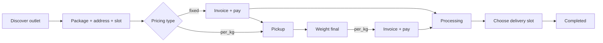
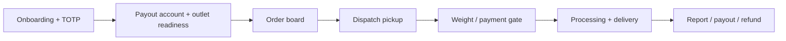
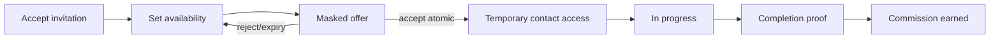
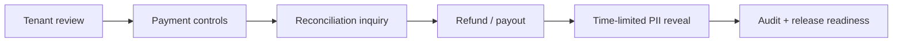

# Responsive Wireflows

Prototype interaktif menggunakan route `/milestone-0/wireflows/{role}?step={step-id}`. Query `step` hanya memilih fixture layar; tidak ada mutation, authentication palsu, atau persistence.

## Responsive contract

- Mobile: satu active step, horizontal step picker, lalu CTA previous/next selebar container.
- Desktop: process rail di kiri dan panel detail di kanan.
- Setiap step menampilkan actor action, system response, current status, privacy/security guard, serta branch/failure mode.
- Role dan step dapat diakses keyboard, memiliki visible focus, dan URL dapat dibagikan.
- Invalid role atau step menghasilkan 404 agar prototype tidak menampilkan kontrak yang tidak dikenal.

## Customer

## Tenant owner

## Driver

## Super User

Wireflow ini adalah UX/domain contract, bukan bukti bahwa feature sudah diimplementasikan. Dashboard dan wireflow selalu menyebut data sebagai fixture tanpa database.
